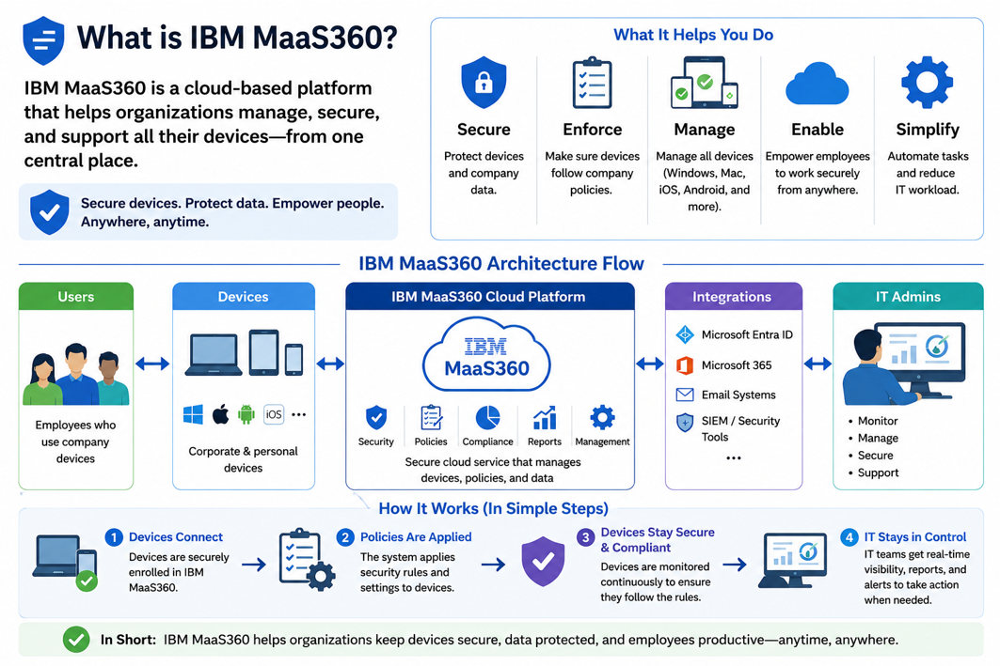
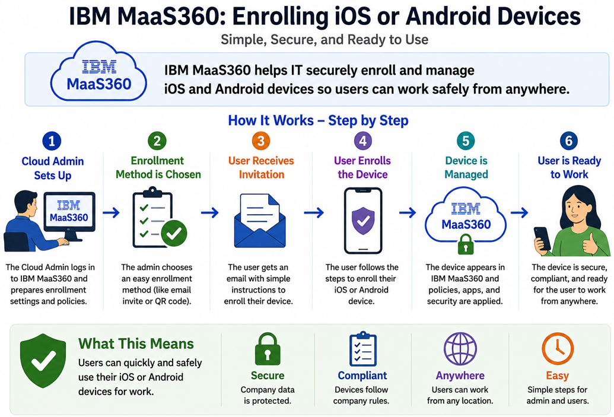
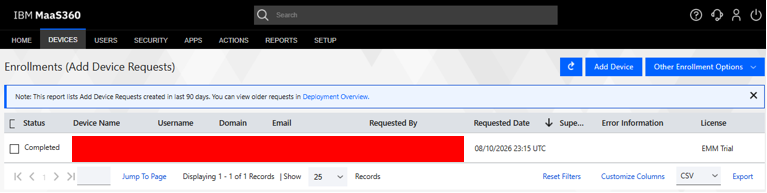
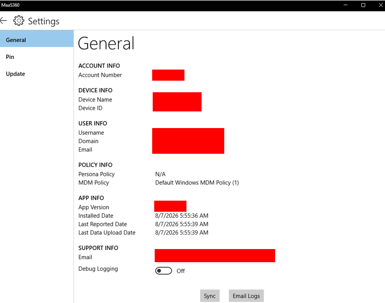
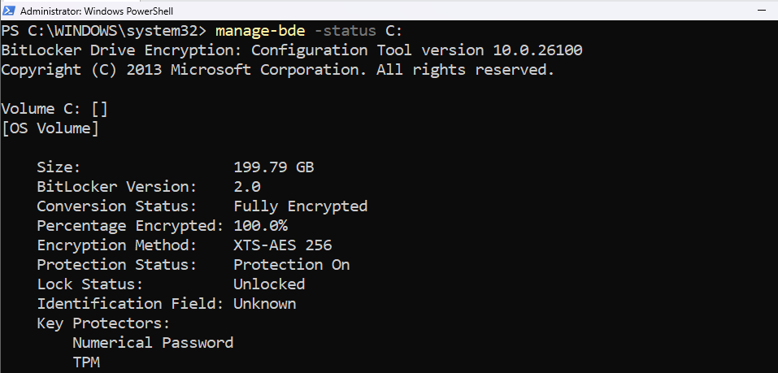
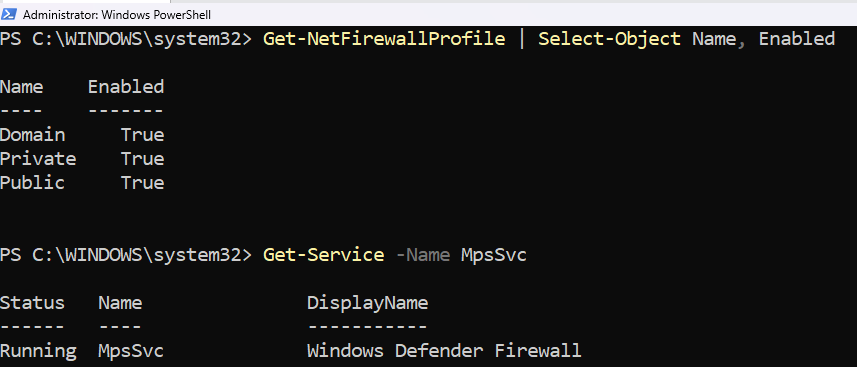
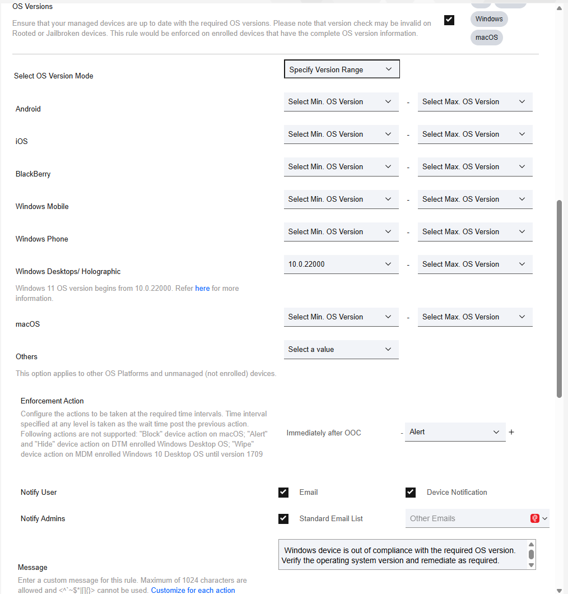
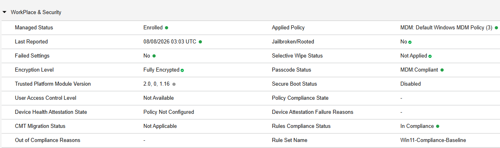
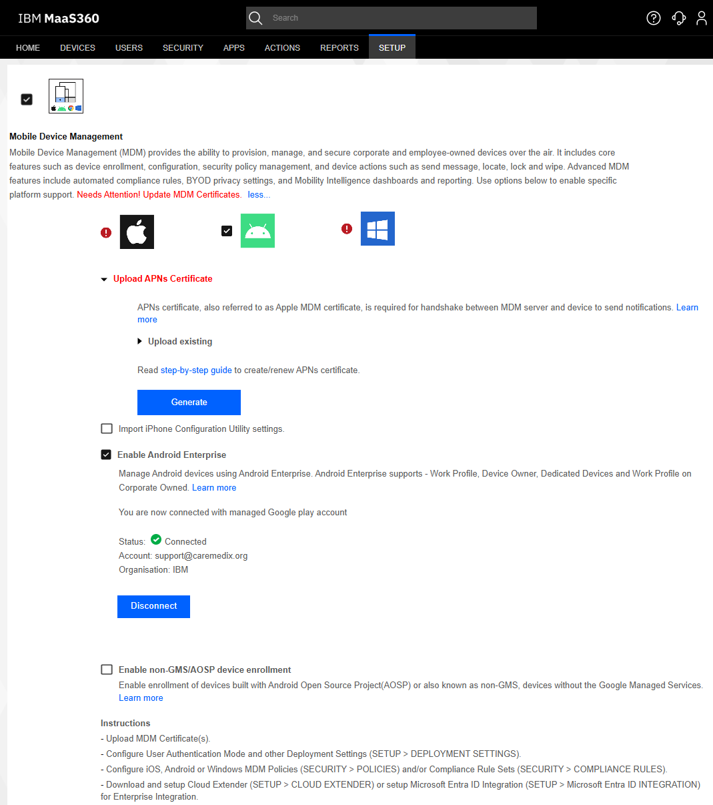
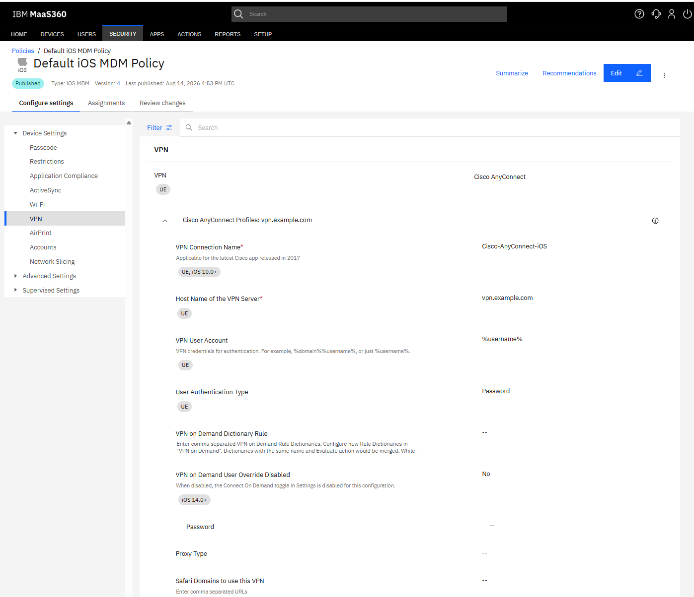

# IBM MaaS360 UEM Deployment & Security Lab

## What is IBM MaaS360?

IBM MaaS360 is a cloud-based unified endpoint management (UEM) platform. It gives administrators one place to enroll devices, apply security settings, distribute apps, check compliance, and protect company data across Windows, Android, iOS, and other platforms.

## Project overview

This lab demonstrates a practical device-management workflow in an isolated test environment. A MaaS360 cloud administrator creates policies and assigns them to enrolled devices. The devices receive those settings, report their status, and can be checked against compliance rules.

**Architecture flow:**

`MaaS360 cloud admin portal` → `Enrollment and policy assignment` → `Windows 11, Android, and iOS devices` → `Security and compliance status returned to MaaS360`

## Lab highlights

### Windows 11 enrollment and management

A Windows 11 virtual machine was created, enrolled in MaaS360, and assigned a Windows MDM policy. The device was then checked to confirm that management and endpoint settings were applied.

| Enrollment | Policy verification |
|---|---|
|  |  |

### BitLocker and Windows Defender Firewall

The Windows security policy was configured to enable silent BitLocker drive encryption and protect the recovery key. Windows Defender Firewall settings were also configured and verified on the managed endpoint.

| BitLocker encryption | Firewall verification |
|---|---|
|  |  |

### Compliance policies

Compliance rules were created for enrollment status and supported Windows versions. A baseline check confirmed that the managed Windows 11 device met the expected requirements.

| Compliance rule | Baseline result |
|---|---|
|  |  |

### Android Enterprise

Android Enterprise was authorized and connected to MaaS360. This provides the foundation for managing Android work profiles, approved apps, and company-owned devices.

### Cisco Secure Client / AnyConnect for iOS

Cisco Secure Client (formerly AnyConnect) was selected from the iOS app catalog, added to MaaS360, and included in an iOS VPN policy. This demonstrates the setup path for centrally managed secure access.

## Documentation

The [documentation index](docs/README.md) maps the full screenshot set to each part of the lab. The main evidence groups are:

- [Windows enrollment and policy evidence](docs/README.md#windows-11-enrollment-and-management)
- [BitLocker and firewall evidence](docs/README.md#bitlocker-and-windows-defender-firewall)
- [Compliance evidence](docs/README.md#compliance-policies)
- [Android and iOS evidence](docs/README.md#mobile-platforms)

## Key skills demonstrated

- Unified endpoint management across Windows, Android, and iOS
- Device enrollment and policy assignment
- BitLocker encryption and recovery-key handling
- Windows Defender Firewall configuration and validation
- Compliance rule design and baseline checks
- Android Enterprise connection and authorization
- Managed iOS app and VPN policy setup
- Clear technical documentation and evidence collection

## Lessons learned and troubleshooting

- Policy changes may not appear immediately; a device sync and a short wait may be required.
- Enrollment status should be confirmed before troubleshooting a policy that appears missing.
- BitLocker readiness depends on the Windows edition, TPM state, and device configuration.
- Security settings should be verified on both sides: in the MaaS360 portal and on the endpoint.
- App availability and VPN options can vary by platform, license, region, and MaaS360 configuration.
- Clear names for policies, rules, and screenshots make testing and review much easier.

## Lab limitations and disclaimer

This is a personal, isolated lab created for learning and portfolio demonstration. It is not a production deployment and does not represent an IBM, Cisco, or employer environment. No real company data or production devices were used. Some features were configured or validated at the management-console level rather than tested with full enterprise infrastructure. Product screens and available options may change over time.

IBM, MaaS360, Cisco, AnyConnect, Android, iOS, Windows, BitLocker, and Windows Defender are trademarks of their respective owners. This project is not affiliated with or endorsed by those companies.

# Author

## James Banday

Cloud | DevOps | Unified Endpoint Management (UEM) | Cybersecurity

**LinkedIn:**
https://www.linkedin.com/in/james-allen-morta-banday-62a391128/

**GitHub Repository:**
https://github.com/jbanday808/ibm-maas360-uem-deployment-lab

This project demonstrates hands-on experience with **IBM MaaS360 UEM**, including **Windows, iOS, and Android device enrollment, security policy enforcement, compliance monitoring, Android Enterprise, device troubleshooting, and Cisco Secure Client VPN configuration**.

