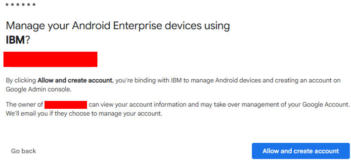

# Android Enterprise with IBM MaaS360

## What is Android Enterprise?

Android Enterprise is Google's system for safely managing Android devices used for work. It allows an organization to apply security rules, provide approved apps, and keep business data protected without managing everything manually on each device.

## Connecting MaaS360 to Managed Google Play

MaaS360 connects to Managed Google Play through an authorized Google account. The administrator allows IBM to manage Android Enterprise services, then MaaS360 confirms that the account is connected. This connection lets approved Android apps and settings be managed from the MaaS360 console.

## Company-owned Device Owner enrollment

Device Owner enrollment is designed for company-owned devices. It is normally completed during the device's initial setup, before a personal account or other settings are added. Once enrolled, MaaS360 can manage the whole device, install approved work apps, and enforce company security requirements.

## Android security policy settings

An Android security policy can be used to require a screen lock, set password rules, control app installation, block unsafe device changes, and check whether the device meets company requirements. Policies should start with the minimum settings needed and be tested before wider use.

## Android 14 Device Admin enrollment issue

The lab encountered an enrollment issue when attempting the older **Device Admin** method on Android 14. Device Admin is a legacy management approach and newer Android versions limit many of its capabilities. For a company-owned Android 14 device, **Android Enterprise Device Owner** enrollment is the preferred path. A factory reset may be required because Device Owner enrollment must usually begin during initial setup.

## Basic troubleshooting

- Confirm that Android Enterprise shows **Connected** in MaaS360.
- Use a supported Android Enterprise enrollment method instead of legacy Device Admin.
- For Device Owner enrollment, begin with a new or factory-reset test device.
- Check internet access, date and time, and Google Play services before trying again.
- Sync the device and allow time for new apps or policies to appear.
- Review the MaaS360 device record for enrollment or compliance messages.

## Key takeaways

- Managed Google Play connects MaaS360 to Google's business app services.
- Device Owner gives an organization full control of a company-owned device.
- Modern Android devices should use Android Enterprise enrollment.
- Successful enrollment should be confirmed in both MaaS360 and on the device.

> **Lab note:** This was an isolated learning environment, not a production deployment. Available options can vary by Android version, device maker, MaaS360 license, and organization settings.

[Return to the documentation index](README.md)

