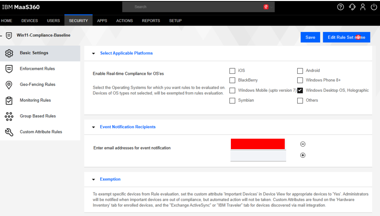
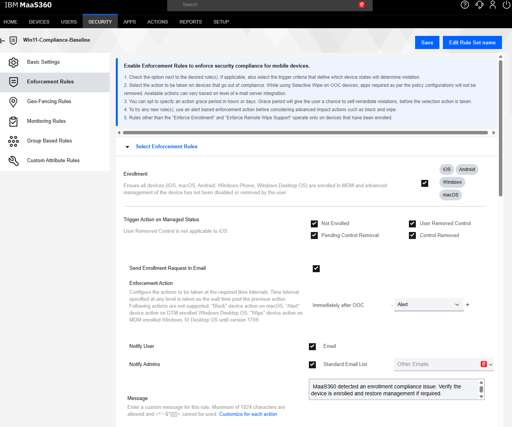

# Compliance Management with IBM MaaS360

## What does device compliance mean?

Device compliance means checking whether a managed device follows an organization's basic security requirements. A compliant device meets the rules; an out-of-compliance device has one or more issues that need attention.

## What MaaS360 checks

MaaS360 uses compliance rules to compare a device's reported status with the required baseline. In this lab, the checks focused on:

- **Enrollment:** Is the device still connected to and managed by MaaS360?
- **Operating system:** Is the device running an approved Windows version?
- **Encryption:** Is BitLocker protecting the device's drive?

| Compliance platform | Enrollment rule |
|---|---|
|  |  |

## Identifying an out-of-compliance device

MaaS360 marks a device when its reported status does not meet a rule. The administrator can review the device record and compliance details to see which check failed, such as missing enrollment, an unsupported OS version, or encryption that is not enabled.

## Basic remediation

1. Review the failed rule in the MaaS360 device record.
2. Confirm that the device is enrolled, online, and able to sync.
3. Correct the issue—for example, re-enroll the device, install an approved OS update, or enable BitLocker.
4. Sync the device so it can report its updated status.
5. Allow time for MaaS360 to run the compliance check again.

## Verifying a return to compliance

After remediation, check the device in MaaS360 and confirm that the failed rule has cleared and the overall status has returned to compliant. The setting should also be checked on the device itself. This two-part check confirms that the change was applied and successfully reported back to MaaS360.

## Key takeaways

- Compliance turns security expectations into clear, repeatable checks.
- A failed status identifies the requirement that needs attention.
- Remediation is not complete until the device syncs and MaaS360 confirms compliance again.
- Both the MaaS360 console and the endpoint should be used for verification.

> **Lab note:** This was an isolated learning environment, not a production deployment. Compliance rules and automated actions should be tested carefully before wider use.

[Return to the documentation index](README.md)

