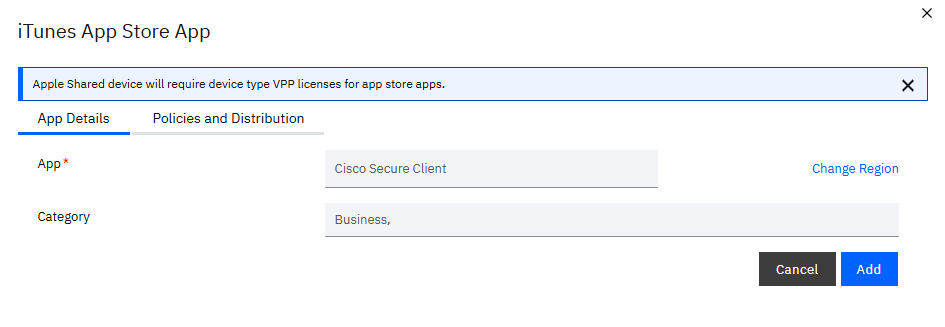
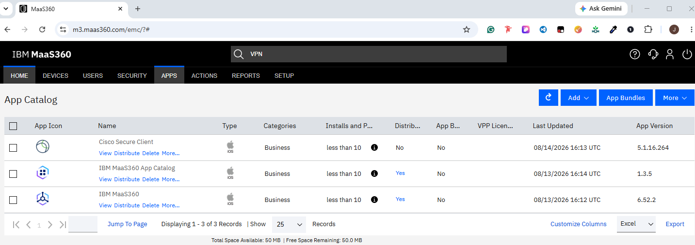

# iOS Device Management with IBM MaaS360

## What is iOS device management?

iOS device management gives an organization a central way to protect and support work iPhones and iPads. Administrators can apply security rules, provide approved apps, configure work access, and check whether a device meets company requirements.

## Enrollment and management

MaaS360 sends an enrollment request to the iPhone or iPad. The user follows the instructions and approves a management profile on the device. Once enrollment is complete, MaaS360 can send approved settings and apps, view basic device status, and check compliance. Company-owned devices can support additional controls when they are prepared through Apple's business deployment services.

## Security and passcode policies

An iOS security policy can require a device passcode, set passcode length and timeout rules, and restrict selected device features. It can also help protect work data by controlling how managed apps share information. Policies should be tested on a lab device before they are assigned more widely.

## Cisco Secure Client / AnyConnect VPN

Cisco Secure Client, formerly known as AnyConnect, was selected from the iOS app catalog and added to MaaS360. An iOS VPN policy was then configured to use the app. This setup allows an organization to provide a consistent, centrally managed path to protected work resources.

| App selected | App added |
|---|---|
|  |  |

## Troubleshooting and compliance checks

- Confirm that the device appears as enrolled and active in MaaS360.
- Check that the management profile remains installed on the iPhone or iPad.
- Confirm that the correct policy and app were assigned to the device or user.
- Sync the device and allow time for new settings or apps to appear.
- Verify internet access if the device cannot contact MaaS360 or download an app.
- Review the compliance result for issues such as a missing passcode or outdated software.
- Confirm that required Apple management certificates are current if updates stop reaching devices.

## Key takeaways

- MaaS360 provides one place to manage iOS security, apps, and work access.
- Passcode policies help protect both the device and company information.
- Managed VPN settings make secure access easier and more consistent for users.
- A policy should be verified in MaaS360 and on the device before it is considered complete.

> **Lab note:** This was an isolated learning environment, not a production deployment. VPN connectivity to a live company network was outside the lab scope. Available settings can vary by iOS version, device ownership, Apple services, and MaaS360 license.

[Return to the documentation index](README.md)

