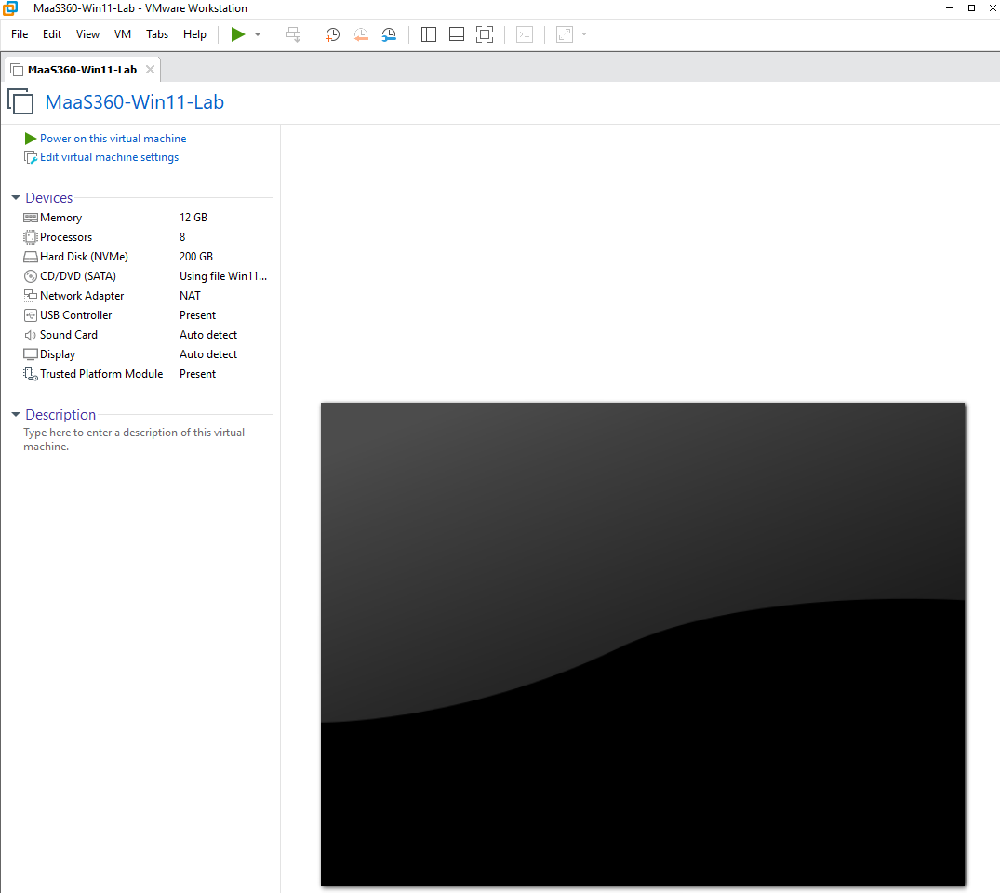
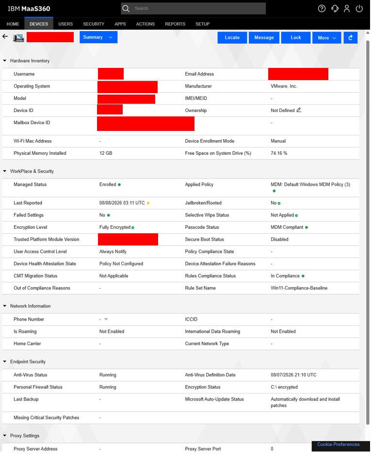

# Windows 11 Enrollment with IBM MaaS360

## Enrollment overview

Windows enrollment connects a device to MaaS360 so an administrator can apply work settings, check security status, and support the endpoint from one console.

In this lab, a Windows 11 virtual machine was prepared and enrolled through the Windows work or school account settings. The user entered the enrollment details, approved the connection, and allowed MaaS360 to create the management link.

| Windows 11 lab device | MDM enrollment |
|---|---|
|  |  |

## Verifying that the device is managed

After enrollment, the device should appear in the MaaS360 portal with its basic details and recent activity. On Windows, the connected work or school account should show that the device is managed. Checking both locations confirms that the connection is active.

## Applying and refreshing policies

MaaS360 policies are assigned to the device or its user. The device downloads the settings during its normal check-in. If a change does not appear immediately, the administrator can confirm the assignment and start a manual sync from Windows or MaaS360. A short delay may be expected.

## Basic enrollment troubleshooting

- Confirm that the device has internet access and the enrollment request is valid.
- Check that the correct user and Windows device were selected.
- Make sure an old or incomplete work account is not blocking enrollment.
- Confirm that the Windows edition and account have permission to enroll.
- Restart the device, retry the connection, and review any displayed error.
- After enrollment, sync the device and allow time for its record to update.

## Key validation steps

1. Confirm that Windows shows a connected work or school account.
2. Find the device in MaaS360 and check that it recently contacted the service.
3. Confirm that the correct Windows policy is assigned.
4. Sync the device and verify that the expected setting appears in Windows.
5. Review the device's compliance and security status in MaaS360.

## Key takeaway

Enrollment is complete only when the device appears in MaaS360, receives its assigned policy, and shows the expected settings on Windows. Verifying all three provides clear evidence that management is working.

> **Lab note:** This was an isolated Windows 11 virtual machine used for learning. Production enrollment steps can vary by identity service, Windows edition, license, and organization settings.

[Return to the documentation index](README.md)

