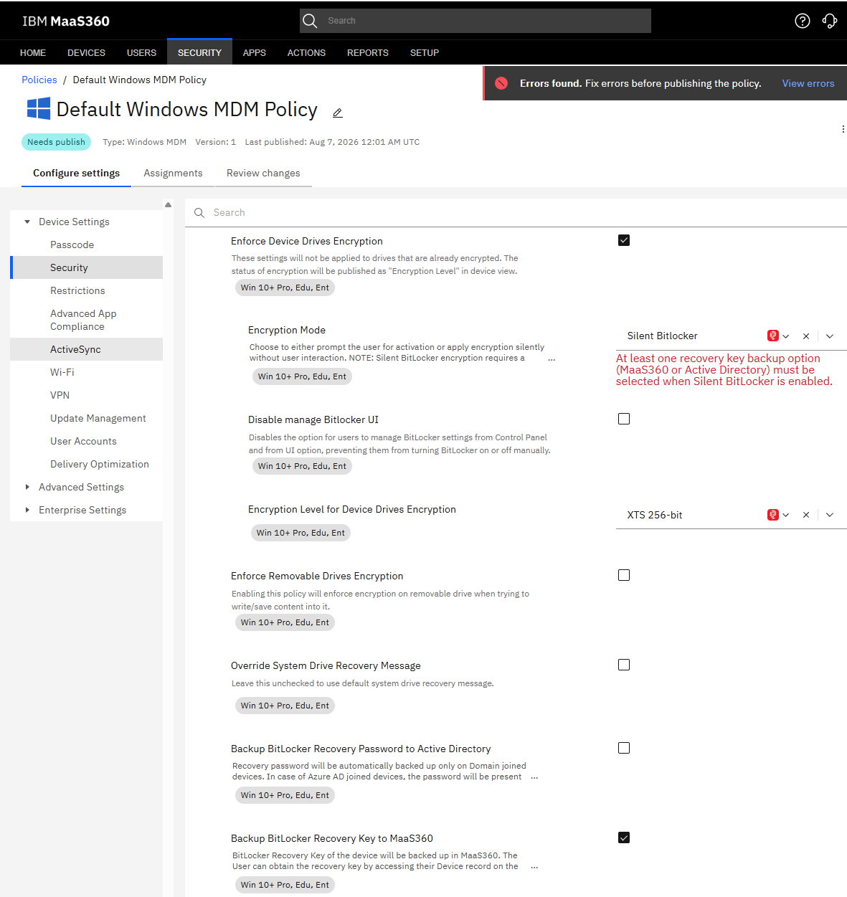
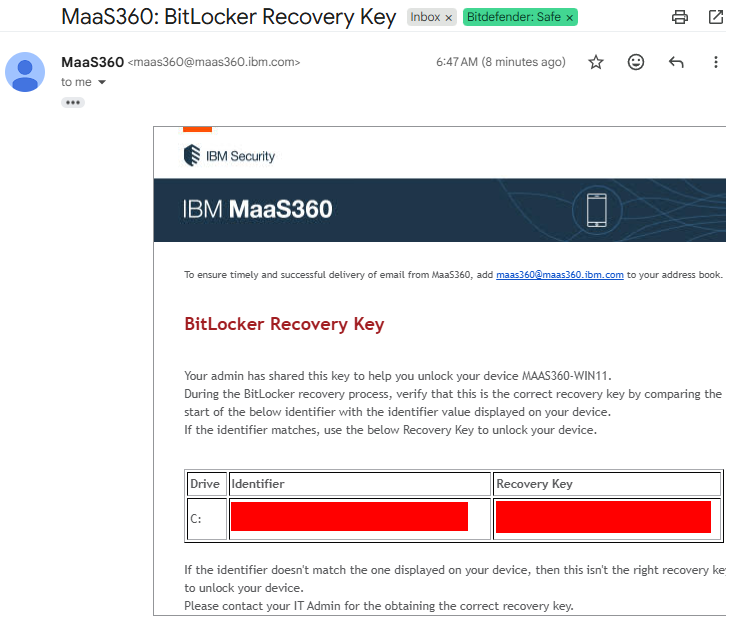
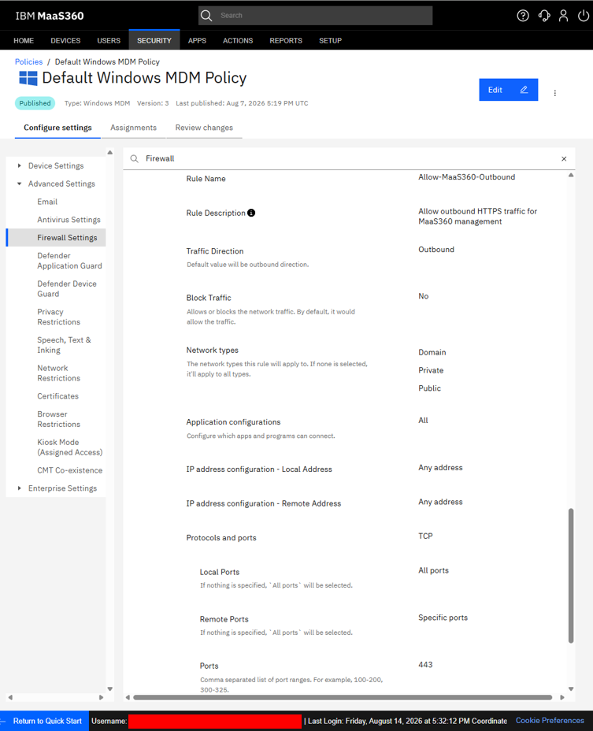
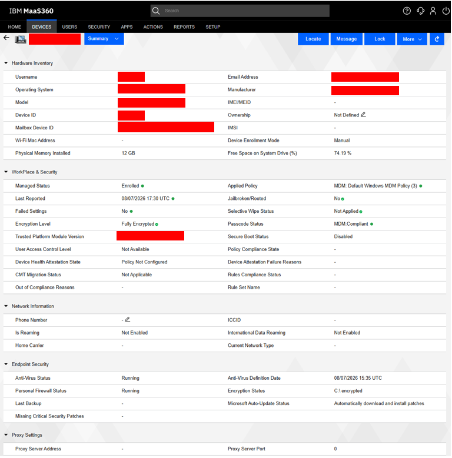

# Windows Security Baseline with IBM MaaS360

## What is a Windows security baseline?

A security baseline is a minimum set of settings used to protect every managed Windows device. It creates a consistent starting point so important controls—such as drive encryption and the firewall—are not left to individual users.

## BitLocker encryption

MaaS360 can send a Windows policy that enables BitLocker with approved settings. BitLocker encrypts the device's drive so its data is harder to access if the computer is lost or stolen. In this lab, silent encryption was configured, the drive status was checked, and the recovery key was verified.

| BitLocker policy | Encryption verified |
|---|---|
|  |  |

The recovery key provides an emergency way to unlock the drive. It should be stored securely and only shared with authorized people.

## Windows Defender Firewall

MaaS360 can manage Windows Defender Firewall settings and rules. The firewall helps block unwanted network traffic while allowing approved connections. The lab confirmed that the rule was configured and that the firewall service was running on the endpoint.

| Firewall rule | Firewall service |
|---|---|
|  |  |

## Verifying settings with PowerShell

PowerShell provides a quick way to read the device's current security status. In this lab, it was used to confirm results such as BitLocker protection and the firewall service state. These checks did not replace the MaaS360 console; they provided device-level proof that the assigned settings took effect.

## Troubleshooting and validation

1. Confirm that the Windows device is enrolled, online, and recently synced.
2. Check that the correct security policy is assigned and published.
3. Verify that the Windows edition and device hardware support the required setting.
4. Review BitLocker and firewall status directly on the endpoint, including with PowerShell.
5. Restart or sync the device if MaaS360 displays an older status.
6. Confirm that the recovery key is available before changing BitLocker settings.
7. Check the setting in both MaaS360 and Windows before marking the task complete.

## Key takeaway

A strong baseline combines central policy with endpoint validation. MaaS360 defines the expected security settings, while Windows and PowerShell confirm that the device is actually protected.

> **Lab note:** This baseline was created in an isolated Windows 11 learning environment. Production settings should be tested and approved for the organization's devices, users, and recovery process.

[Return to the documentation index](README.md)

